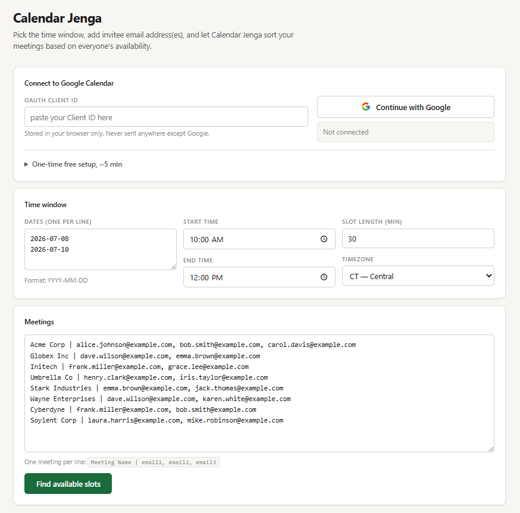
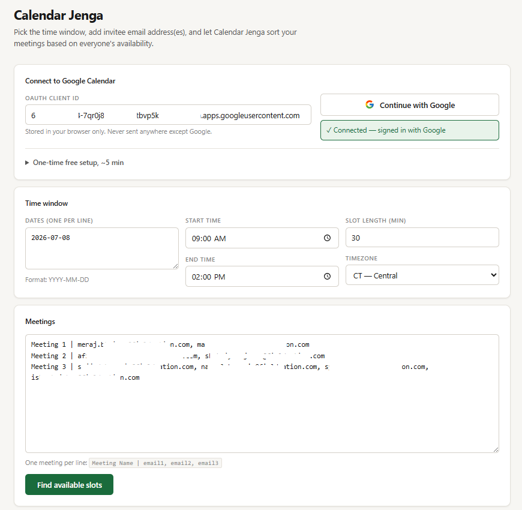
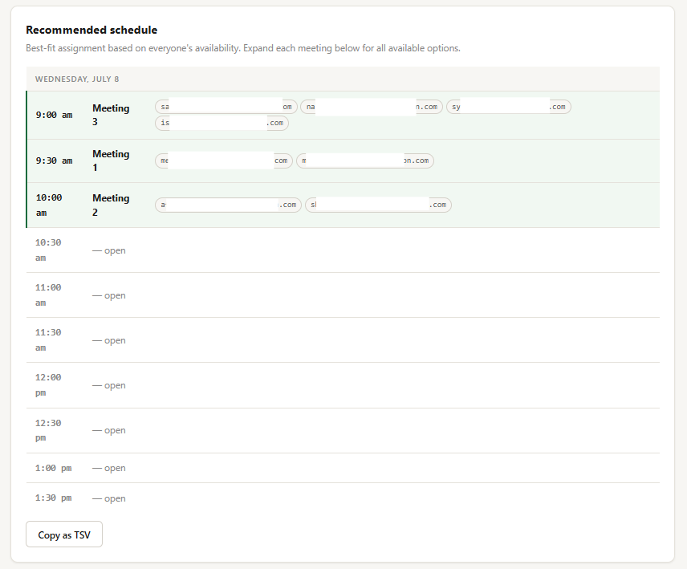
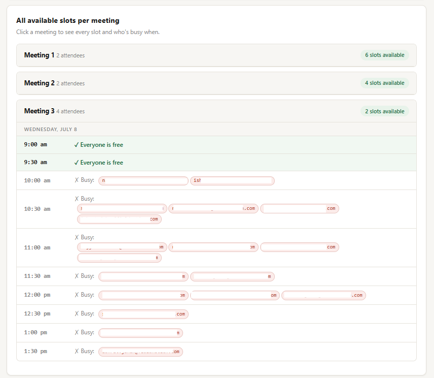

<p align="center">
  
</p>

<p align="center">
  Stop playing calendar Tetris by hand.<br>
  Connect to Google Calendar, paste your meetings, get a schedule that actually works.
</p>

<p align="center">
  <a href="https://meraj-music.github.io/CalendarJenga/">Use it now</a> · <a href="#setup">Setup guide</a> · <a href="#how-it-works">How it works</a>
</p>

---

## What is this?

Calendar Jenga is a free, open-source tool that finds available meeting slots across multiple people's Google Calendars, instantly. No more toggling between "Find a time" tabs, no more Slack threads asking "does 10:30 work for everyone?"

You give it a list of meetings with attendee emails, a time window, and it checks everyone's real calendar availability and sorts the meetings into open slots automatically.

**Zero backend. Zero data collection.** Everything runs in your browser. The only external call is to Google's Calendar API, using the narrowest possible permission (free/busy times only — it can't see event titles, descriptions, or anything else).

---

## How it works

### 1. Connect & configure

Paste your Google OAuth Client ID (one-time setup — see below), click **Continue with Google**, then set your date range, time window, and slot length.

<p align="center">
  
</p>

### 2. Add your meetings and hit go

List each meeting on its own line: `Meeting Name | email1, email2, email3`. Replace the example data with real attendee emails and click **Find available slots**.

<p align="center">
  
</p>

### 3. Get the recommended schedule

Calendar Jenga checks every attendee's calendar and assigns meetings to slots where everyone is free. The recommended schedule is copy-paste ready (hit **Copy as TSV** to drop it into a spreadsheet).

<p align="center">
  
</p>

### 4. See all available options per meeting

Need to move things around? Click any meeting to expand it and see every slot — who's free, who's busy, and exactly who the blocker is. Green rows mean go, red pills show who's booked.

<p align="center">
  
</p>

---

## Setup

This takes about 5 minutes, one time. After that, anyone on your team just visits the link and clicks **Continue with Google**.

1. Go to [console.cloud.google.com](https://console.cloud.google.com/) and create a project (or use an existing one).

2. Enable the **Google Calendar API**: go to **APIs & Services → Library**, search "Google Calendar API", click **Enable**.

3. Configure the OAuth consent screen: go to **Google Auth Platform → Branding**.
   - App name: `Calendar Jenga`
   - User support email: your email
   - Audience: **Internal** (if you're on Google Workspace and want org-only access) or **External** (for anyone — click **Publish App** after saving to move out of testing mode)
   - Developer contact: your email
   - Save.

4. Add the scope: go to **Google Auth Platform → Data Access** → **Add or Remove Scopes** → search `freebusy` → check **Google Calendar API — calendar.freebusy** → Update → Save.

5. Create credentials: go to **Google Auth Platform → Clients** → **Create Client**.
   - Application type: **Web application**
   - Authorized JavaScript origins: `https://meraj-music.github.io`
   - Leave redirect URIs empty
   - Click **Create** and copy the **Client ID**.

6. Paste the Client ID into Calendar Jenga and share it with your team.

---

## Privacy & security

- **Browser-only.** No server, no database, no analytics. Your data never leaves your machine except for the Google Calendar API call.
- **Minimal permissions.** The only OAuth scope is `calendar.freebusy` — read-only access to free/busy times. Calendar Jenga cannot see event titles, descriptions, attendees, or any other detail. It cannot create, modify, or delete events.
- **Your Client ID, your control.** The OAuth Client ID belongs to your Google Cloud project. You can revoke it, rotate it, or delete it at any time from the Google Cloud Console.

---

## Running locally

If you'd rather not use the hosted version:

```bash
git clone https://github.com/meraj-music/CalendarJenga.git
cd CalendarJenga
python3 -m http.server 8080
```

Open `http://localhost:8080` and add `http://localhost:8080` as an Authorized JavaScript origin in your Google Cloud credentials.

---

## Built with

HTML, CSS, vanilla JavaScript, and the [Google Calendar freeBusy API](https://developers.google.com/calendar/api/v3/reference/freebusy/query). No frameworks, no build step, no dependencies beyond the Google Sign-In script.

---

## License

MIT — use it, fork it, make it yours.
